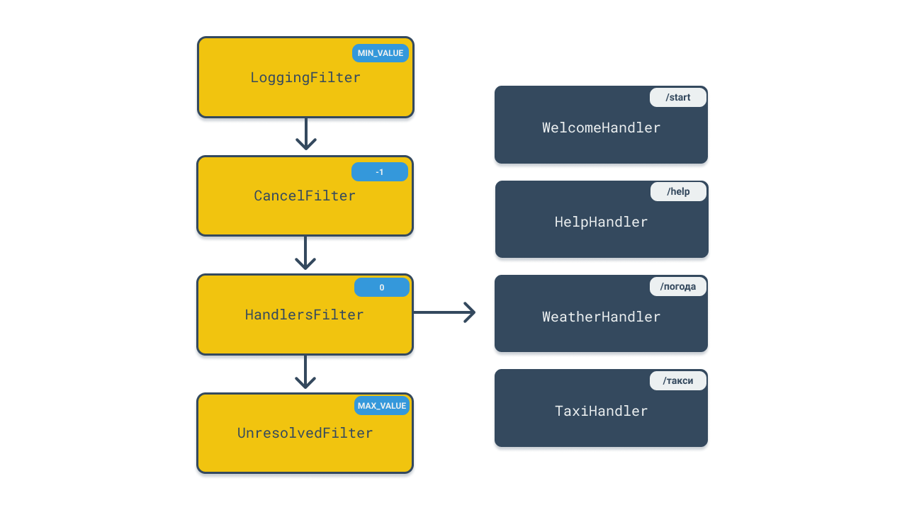

<!-- Description -->

## Settings

```
telegram.access-key=                  # api key
telegram.mode=                        # polling (default), webhook
telegram.webhook-base-url=            # required for webhook mode
telegram.webhook-endpoint-url=        # optional
telegram.payment-provider=            # payment provider key
```

## Usage


Add `.kts` in resource `handlers` folder:
`resources/handlers/ExampleHandler.kts`.


```kotlin
enum class PaymentMethod {
    CARD, CASH
}

handler("/taxi") {
    step<String>("locationFrom") {
        question {
            MarkdownMessage("Start point:")
        }
    }

    step<String>("locationTo") {
        question {
            MarkdownMessage("Where to:")
        }
    }

    step<PaymentMethod>("paymentMethod") {
        question {
            MarkdownMessage("Card or cash?", "Card", "Cash")
        }

        validation {
            when (it.toLowerCase()) {
                "Card" -> PaymentMethod.CARD
                "Cash" -> PaymentMethod.CASH
                else -> throw ValidationException("You should choose one of the variants above")
            }
        }
    }

    process { state, answers ->
        val from = answers["locationFrom"] as String
        val to = answers["locationTo"] as String
        val paymentMethod = answers["paymentMethod"] as PaymentMethod

        // Business logic

        MarkdownMessage("Order confirmed. $from в $to. Payment $paymentMethod.")
    }
}
```

## Error handling


